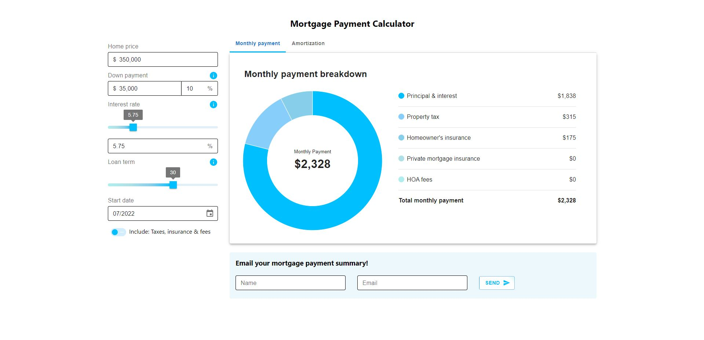

# Mortgage Payment Calculator

The Mortgage Payment Calculator is a portfolio project that I created to assist potential home buyers to calculate their monthly mortgage payment based on home loan details such as, home price, down payment, interest rate, loan term and other factors. In addition to the monthly payment breakdown, the application also calculates the total interest paid over the lifetime of the loan and the amortization schedule. The home loan amortization data is displayed both as a line chart and in tabular format, providing detailed information regarding each scheduled payment. The app is responsively designed for all device types and is deployed via Heroku at [Mortgage Payment Calculator](https://mortgage-payment-calculator.herokuapp.com/).

## Table of Contents

- [Features](#features)
- [Technologies](#technologies)
- [Screenshots](#screenshots)
- [Future Work](#future_work)
- [Status](#status)

## Features

### Client-side Features
The client side of the application was built with Material UI, TypeScript, React, React-Redux, and React Google Charts, and includes the following features:

- An input bar to enter relevant home loan information such as the home price, down payment, interest rate, loan term, start date, etc.
- Helpful information tooltips are shown to explain terms and input fields where necessary.
- A donut chart and legend to display the proportions of the monthly payment that pertain to principal and interest, property tax, homeowner's insurance, etc.
- A section to display details such as the loan amount, total interest paid, total cost of the loan and the payoff date.
- A line chart which shows the accumulation of the principal paid, the interest paid and the remaining balance over time.
- An amortization schedule breakdown which shows the date, amount of principal, amount of interest and the loan balance remaining for each of the total number of scheduled payments.
- The amortization schedule table also has an export option to print or download the data as a CSV file.
- Lastly, there is an email form to enter a name and email address to have the monthly payment summary and loan totals delivered by email.

### Server-side Features
The server side of the project was created with TypeScript, Node.js, Express and MongoDB and includes the following features:

- A main route handler for processing new loan POST requests sent from the frontend and saving them to the Mongo database.
- The route handler also inserts the loan values into a simple html email template that sends the email utilizing the Nodemailer module.

## Technologies

Frontend:

- TypeScript: 4.7.4
- Material UI: 5.8.5
- React: 18.2.0
- React Redux: 8.0.2
- Redux Toolkit: 1.8.2
- React Google Charts: 4.0.0
- Axios: 0.27.2

Backend:

- TypeScript: 4.7.4
- Node: 16.14.0
- Express: 4.18.1
- MongoDB: 4.7.0
- Nodemailer: 6.7.5
- Body Parser: 1.20.0
- Concurrently: 7.2.2
- Dotenv: 16.0.1
- Morgan: 1.10.0
- Nodemon: 2.0.18
- Path: 0.12.7
- Uuid: 8.3.2

## Screenshots

## Future Work

None scheduled.

## Status

This project has been completed.